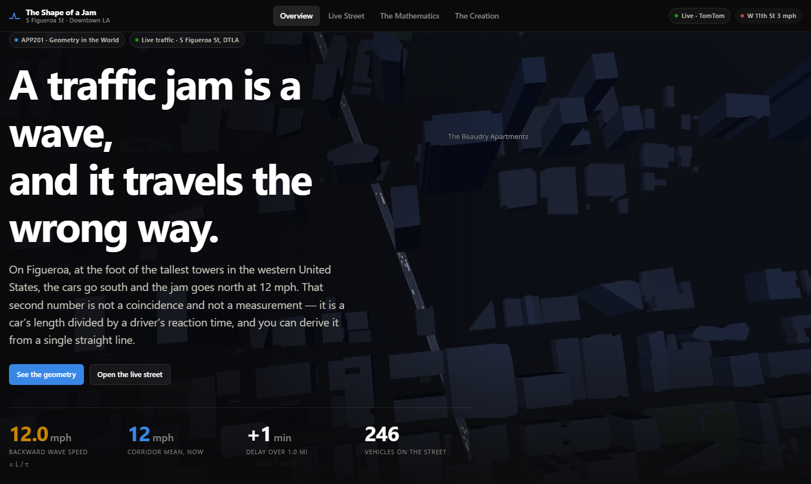
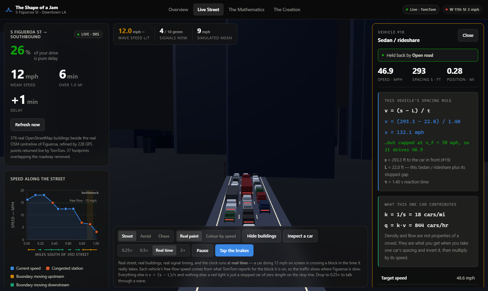
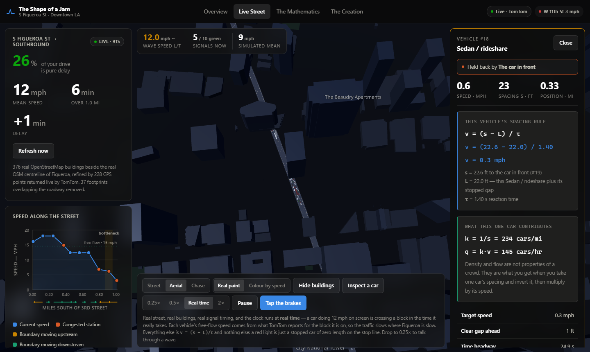
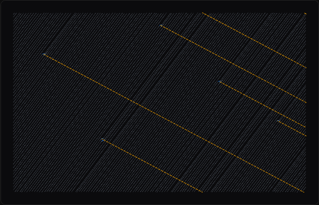

<div align="center">

<br>

# The Shape of a Jam

### A traffic jam is a wave — and it travels the wrong way.

**At a red light on Figueroa, the cars go south and the back of the queue goes north at 12 mph.**
That number isn't measured. It's a car's length divided by a driver's reaction time.

<br>

[](https://rohit-ats.github.io/APP201-Midterm-Project/)

<br>


<br>



</div>

<br>

---

<br>

## 🤔 The question

I walk the same intersection almost every day.

Stand at one long enough and you start counting without meaning to. A green light doesn't let *the traffic* through — it lets a **specific number of cars** through, and that number is oddly consistent. If you're inside it, you make the light. One car behind it, you watch the whole cycle go by and try again.

Some days the line clears in one go. Some days the same-looking line needs two.

**I wanted to know what decides that.**

And then I noticed a second thing. When the light goes red, the brake lights don't all come on at once. They light up one at a time, travelling *backwards* down the block, reaching cars that haven't even arrived yet.

So the queue is moving. Not the way traffic moves — moving **against** it.

<br>

---

<br>

## ✏️ The answer, in one line

Everything starts from one question: **how much road does one car need?**

Not just its body — the body *plus* the gap in front the driver won't give up. Drivers don't think in feet, they think in seconds. So:

```
s  =  L  +  v × τ

room one car takes  =  car length  +  (speed × reaction time)
```

That's a straight line. The intercept is the length of a car. The slope is reaction time.

Rearrange it, and the speed of the back of the queue falls out:

```
        L         24.6 ft
w  =  —————  =  —————————  ≈  12 mph, BACKWARDS
        τ          1.4 s
```

> **Look at what isn't in that formula.**
> Not the street. Not the number of lanes. Not how many cars there are, or what caused the jam, or what city you're in.
> **Only the length of a car and the reaction time of a human being.**

Which predicts something you can check: jam waves should run backwards at about the same speed everywhere on Earth. Measurements from Los Angeles, a Japanese test track and German autobahns all land between **10 and 15 mph**.

<br>

---

<br>

## 👆 Click any car



Click a car and it does **that car's own sum**, live, with its own numbers in it — and tells you what's holding that particular driver back right now: open road, the car in front, or a red light.

```
v = (s − L) / τ
v = (95.2 − 22.6) / 1.40
v = 35.3 mph        …but capped at 30 mph, so it drives 30.0
```

That's the point I most wanted to make. The model isn't a statement about traffic in general. It's a rule every single driver is following right now, and all of them are solving the same two-term sum with different numbers.

<br>

---

<br>

## 🌆 Everything here is real



| What | Where it comes from |
|:--|:--|
| 🚦 **Traffic speeds** | TomTom live, all 10 intersections, refreshed every 2 minutes |
| 🛣️ **The street** | The real OpenStreetMap centreline of S Figueroa, nudged by the GPS points TomTom returns |
| 🏙️ **376 buildings** | Real OSM footprints at their real heights — the Wilshire Grand is 335 m because it is |
| 🗺️ **1,955 street ways** | The cross-street grid, the 110 ramps, 921 sidewalks, Pershing Square |
| ⏱️ **Signal timing** | 90-second cycles on an offset progression, how LADOT runs the downtown grid |
| 🚗 **The cars** | Simulated — a traffic API tells you how fast things move, never what they are. Types are drawn from the real downtown mix at true sizes |

The clock runs at **real time**. A car doing 13 mph on screen crosses a block in the time it really takes.

<br>

---

<br>

## 🧵 What I made



**Shockwave Braid.**

A space-time diagram has two families of lines in it: the cars, climbing one way, and the jam fronts, falling the other. Two sets of parallel threads crossing at an angle is the definition of woven cloth.

So instead of drawing a picture *about* the mathematics, I let the mathematics *be* the weave. Every warp thread is a real vehicle trajectory. Every weft thread is a jam front, drawn at the one angle a jam front is allowed to have.

Move the τ slider and **every diagonal pivots together**. They can't disagree with each other — the angle was never theirs to choose.

<br>

---

<br>

## ✅ How you know the maths is right

I didn't want "trust me". So `scripts/verify-math.ts` checks **26 things** on every deploy, and if any break, the site doesn't publish.

Three of them are numbers I never tuned, landing on values other people measured in the street:

| Thing | What I get | What the world measures |
|:--|:--|:--|
| How fast a jam goes backwards | **11.98 mph** | 10 – 15 mph |
| Gap between cars crossing the line | **1.96 s** | 1.9 – 2.1 s |
| Cars one lane pushes through | **1,837 /hr** | ~1,900 (Highway Capacity Manual) |

```bash
node --experimental-strip-types scripts/verify-math.ts
```

<br>

---

<br>

## 🏃 Run it yourself

```bash
npm install
npm run dev          # http://localhost:5173
```

It works with **no setup** — there's a recorded reading built in, so it can never go blank during a presentation.

<details>
<summary><b>Want live traffic?</b></summary>

<br>

1. Get a free key at [developer.tomtom.com](https://developer.tomtom.com/) with the **Traffic API** enabled
2. `cp .env.example .env` and paste it into `VITE_TOMTOM_KEY`
3. Restart

The free tier allows 2,500 requests/day. This uses 10 per refresh, every 2 minutes.

> ⚠️ Static sites can't hide API keys. Restrict yours to your own domain in the TomTom dashboard.

</details>

<details>
<summary><b>Rebuilding the map data</b></summary>

<br>

Both baked data files are reproducible from scratch:

```bash
# the buildings
curl -G https://overpass-api.de/api/interpreter -A "your-project/1.0" \
  --data-urlencode 'data=[out:json][timeout:120];way["building"](34.0425,-118.2672,34.0558,-118.2532);out tags geom;' \
  -o osm-buildings.json
node scripts/build-buildings.mjs osm-buildings.json

# the street centreline
curl -G https://overpass-api.de/api/interpreter -A "your-project/1.0" \
  --data-urlencode 'data=[out:json][timeout:90];way["highway"]["name"~"Figueroa",i](34.0400,-118.2700,34.0600,-118.2500);out tags geom;' \
  -o osm-fig.json
node scripts/build-street.mjs osm-fig.json
```

</details>

<br>

---

<br>

## 📁 What's in here

```
src/
├── lib/
│   ├── trafficMath.ts     the maths — spacing, density, flow, the triangle,
│   │                      jam speed, how many cars clear one green
│   ├── simulation.ts      every driver follows ONE rule and nothing else.
│   │                      A red light is just a stopped car of zero length
│   ├── geo.ts             one projection, shared by the road and the buildings
│   ├── tomtom.ts          live data + the GPS-corrected street centreline
│   └── braid.ts           the trajectories the artwork is woven from
├── data/
│   ├── street.json        real OSM centreline of S Figueroa
│   ├── buildings.json     real OSM footprints with real heights
│   ├── vehicleMix.ts      what drives downtown — where L is DERIVED
│   └── snapshot.ts        a frozen real evening-peak reading
├── components/
│   ├── VehicleInspector   one car's own sum, solved live
│   ├── scene/             the 3D street, buildings, signals, traffic
│   └── charts/            the five diagrams
└── sections/              the four pages

scripts/
├── verify-math.ts         26 assertions, gating the deploy
├── build-street.mjs       OSM → street.json
├── build-buildings.mjs    OSM → buildings.json
└── build-roads.mjs        OSM → roads.json
```

<br>

---

<br>

## 🙅 What this model gets wrong

A model that explains everything explains nothing. This is also on the site:

- **Density is inferred, not measured.** TomTom reports speed; I work density out from it — which means the model partly produces the data it's then tested against. Loop-detector counts would fix that, and it's the first thing I'd add.
- **Nobody changes lanes.**
- **Every driver is identical.** One reaction time for everybody. Really it ranges from 0.8 s to over 2.5 s, and that spread is itself a cause of waves.
- **Traffic recirculates.** A car leaving 11th comes back in at 3rd.
- **Nothing turns, parks or crosses.** A lot of real downtown delay is left-turners, double-parked vans and pedestrians.
- **One fitted number.** A single cruise-speed scale, calibrated so the simulated average matches the measured average.

<br>

---

<br>

## 🎯 Where I want to take this

Traffic takes a real piece of everyone's day. That's the problem I actually want to work on, and I wanted to start now rather than wait until I felt qualified.

I picked Los Angeles on purpose. People say LA traffic is unsolvable, and I'd rather work on the hard version.

This is one mile of one street, which is nowhere near solving anything. But it's a mile where the model and the measurements agree, where the geometry predicts a number an engineer can check with a stopwatch, and where I can say exactly which assumption I'd fix next.

A month ago I'd decided I was finished with maths. What changed my mind wasn't a lecture about why maths matters. It was one question, at one intersection, that turned out to have an exact answer.

<br>

---

<br>

<div align="center">

### Rohit Maruri

**APP201 · Geometry in the World**

[](https://rohit-ats.github.io/APP201-Midterm-Project/)
[](https://github.com/Rohit-ATS)

<br>

<sub>Street and building data © OpenStreetMap contributors, ODbL · Traffic data from TomTom<br>
Model: G. F. Newell, *A simplified car-following theory* (2002) · Greenshields (1935) as the rejected comparison</sub>

</div>
